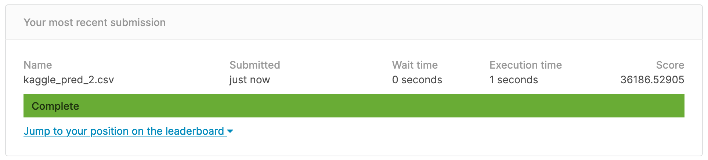

# Project 2 - Ames Housing Data and Kaggle Challenge


## Context & Problem Statement 
---

In this notebook, I will be attempting to predict housing sale price and identify its significant predictors by analysing the Ames Housing Dataset (2006-2010). 

A series of regression models will be trained and evaluated to determine which model fits best in being used as a predicting tool for housing ```SalePrice```. The chosen model will then be used to predict the ```test.csv```, where the predictions will be submitted to [Kaggle](https://www.kaggle.com/c/dsi-us-6-project-2-regression-challenge) for evaluation. 

This analysis will inform homeowners on what they can do to enhance the value of their housing properties, as well as provide information to potential real estate investors, buyers, and even real estate agents on the types of housing estates/neighborhoods to invest in or recommend to buyers. 

## Executive Summary
---

The ```train.csv``` and ```test.csv``` in the Ames Housing Dataset (2006-2010) were first cleaned accordingly. Exploratory analysis was then conducted on the cleaned ```train.csv``` dataset to examine correlations (heatmap for numerical, ordinal and boxplots for nominal features) and spotting trends that may hint at what good predictors of housing sale price could be. Dummy values were then assigned to nominal features via ```pd.get_dummies``` and the dataset was scaled to standardize the scale across the predictors for subsequent consumption by the modelling later on. ```LinearRegression```, ```Ridge```, ```Lasso```, and ```ElasticNet``` were trained on the dataset to evaluate which model best fits it. Specific features were selected by ```Lasso``` for use in the model development using ```ElasticNet``` (a good blend of ```Ridge``` and ```Lasso```). The model was then evaluated with a series of regression metrics including the ```r2_score```, ```RMSE``` and ```adjusted r2_score``` to derive an indication of model performance. Multi-collinearity was then assessed via ```variance-inflation-factor``` (VIF) to further trim the number of features to be used in the model development. Finally, the model was used to predict the ```SalePrice``` target for ```test.csv``` and the predictions were submitted to Kaggle for evaluation. Several important predictors of ```SalePrice``` identified by ```Lasso``` will be highlighted to advise homeowners, real estate agents, and potential house buyers on how housing value can be maximised in terms of ```SalePrice```, or which neighborhoods to focus investments on. 

### Contents:

- [Data Cleaning of train and test csvs](#Data-Cleaning-of-train-and-test-csvs)
- [Exploratory Data Analysis](#Exploratory-Data-Analysis)
- [Evaluation of Regression models and Feature Selection](#Evaluation-of-Regression-models-and-Feature-Selection)
- [Model Development and prediction assessment by Kaggle](#Model-Development-and-prediction-assessment-by-Kaggle)
- [Interpretation of Results](#Interpretation-of-Results)
- [Model Evaluation and Limitations](#Model-Evaluation-and-Limitations)
- [Conclusions and Recommendations](#Conclusions-and-Recommendations)
- [Sources](#Sources)

---

## Data Cleaning of train and test csvs
---
The ```train.csv``` was first examined to determine if the various features were coded appropriately and columns with more than 50% ```NaN```s were either dropped (such as ```Alley``` and ```Fence```), or their ```NaN```s were imputed accordingly based on their respective distributions - nominal and ordinal ```NaN```s were imputed with most frequent values, numerical ```NaN```s were imputed with either mean or median, depending on whether or not the distributions are normal or skewed. For ```test.csv```, noticed that more columns had more than 50% null values but they were examined independent of the ```train.csv``` and eventually the same columns, ```Alley``` and ```Fence``` were dropped while the rest were imputed with ground truths that were presumed based on associations with related columns, eg. ```Fireplace Qu``` and ```Fireplaces```.  


## Exploratory Data Analysis
---
Heatmap was implemented to examine the Pearson correlation coefficients between the target, ```SalePrice```, and the various numerical predictors, of which, there were several identified to be strongly correlated such as ```Overall Qual```, ```Gr Liv Area```, and ```Garage Area```. However, all 3 predictors are correlated in some way with at least 0.50 in terms of correlation coefficient. When fitted together in the same model, they can result in multi-collinearity but this can be dealt with by regularized regression such as ```Lasso``` and so no features were selected at this juncture to be excluded - the Lasso can do the job for us. Boxplots and barplots illustrated distinct relationships between certain ordinal and nominal features such as the aforementioned ```Overall Qual``` and ```Neighborhoods```. It appears that certain neighborhoods such as North Ridge, North Ridge Heights, and Stone Brook have the top 3 median ```SalePrice```s which may appear in the predictions later on. 

## Evaluation of Regression models and Feature Selection
---
The dataset's column names were renamed accordingly to assume lower case characters and spaces between words were replaced by underscores. ```pd.get_dummies()``` was used to convert nominal feature values into 1s and 0s so as to facilitate consumption by the models subsequently as they work better on numbers rather than string objects. ```LinearRegression``` was first fitted to the processed dataset and the cross-predicted R2 score (R2 with cross-validation)  came out negative (-3.24). This means that the ```LinearRegression``` performed worse than the Naive baseline model of using the mean of the target, ```SalePrice```. One possible reason for this is the existence of multiple highly correlated predictors included in the model which regularization will help to curb. Regularized regressions such as ```Lasso``` and ```Ridge```, or a balance of both, ```ElasticNet```, would aid in constraining large coefficients (and shrink small coefficients to zero for ```Lasso```), deal with multi-collinearity, and reduce model complexity, thereby allowing it to generalize better to unseen data later on. The ```Ridge```, ```Lasso```, and ```ElasticNet``` models returned cross-predicted R2 scores of 0.86 each, which means that it was able to explain 86% of the variance in the target, ```SalePrice```. ```Lasso``` filtered out the least important predictors, returning a subset of features that should be focused on for predicting the target, ```SalePrice```. This subset was extracted as a masking list of columns (features) that were fed into the dataframe to train the model of choice. Given that ```ElasticNet``` can toggle between ```Ridge``` and ```Lasso```, it will be the model of choice moving forward.   

## Model Development and prediction assessment by Kaggle
---
The dataset was split into training and test sets via ```train_test_split``` and scaling via ```StandardScaler``` prior to model fitting with ```ElasticNet```. The R2 score was higher at 0.87! Assumptions of MLR were tested and they were loosely fulfilled-more on this later on - in order to test for the independence of the various predictors (subset derived from ```Lasso```), ```variance-inflation-factor``` or (VIF) was used to confirm if there was residual multi-collinearity (even after filtering for important predictors by ```Lasso```). A threshold of [10](https://www.statisticshowto.datasciencecentral.com/variance-inflation-factor/) was adopted. According to the same source, it is acceptable to retain categorical features, containing multiple levels, with high VIF scores.```gr_liv_area```, a numerical feature, had a VIF score of more than 10 and thus it was removed from the list of crucial predictors. The VIF was tested again on this new list and a VIF score of 10 or more was no longer found for any numerical feature. This new list was then fed into the feature dataset and ```ElasticNet``` was ran on it once more to determine the model performance, and its R2 was 0.88 which had improved slightly, and the RMSE was 26,925 dollars (same unit as the target variable, ```SalePrice```).

The final ```ElasticNet``` model was then used to predict the target, ```SalePrice```, in the ```test.csv``` dataset by determining a common set of features present in both the new list of crucial predictors and the ```test.csv```, and subsetting both the scaled and split ```X_train_sc``` and the scaled dataframe of ```test.csv``` so that both have the same number of columns and predictions can be made. The predictions were saved to a csv file and submitted to Kaggle which produced a RMSE score of ~ 36,187 dollars as shown below.



## Interpretation of Results
---
- ```LinearRegression``` performed poorly compared to its regularized regression counterparts and this is expected as regularization helps in tackling datasets with multiple features/dimensions and multi-collinearity such as this Ames Iowa housing data set.

- Exploratory Data Analysis aids in identifying potentially important predictors by examining relationships and correlations between the various predictor variables and the target, ```SalePrice```.

- Multi-collinearity validation methods such as the VIF can help to confirm the existence of multi-collinearity and inform further fine-tuning of the model, allowing a "sweeter" spot to be achieved along the bias-variance tradeoff's spectrum.

- There is a need to ensure that the actual test and train data were handled independetly to avoid "data leakage" which can bias the model performance, which may in turn lead to overfitting.

- Even after cleaning the datasets, there were some incorrect values that "slipped through the cracks", which could affect the model performance.


## Model Evaluation and Limitations
---

- Due to the presence of a significant number of null values in certain columns, those columns were dropped, resulting in potential data loss and imputations of null values with mean, median and mode are methods of estimation at best and thus, interpretations can be problematic. This however, can be resolved with the collection of more data.

- Assumption on linearity of target variable with every predictor may not necessarily be true since the heatmap demonstrated close to 0 correlation for some features. As such, there may be no complete fulfillment of MLR's assumptions.

- Scaling was conducted on the entire dataset after splitting, including the dummy variables - this may underestimate the significance of nominal feature columns in the model development process.

- Model is developed based on Ames Iowa Housing data (2006-2010). In order to determine if it is generalizable across states and time, more data needs to be collected-primarily on housing practices and policies of other states as well as more recent data such as those from 2010 till 2019 or the current year. If the housing practices and policies vary significantly across states, it is unlikely that the model used to predict housing sale prices in Ames Iowa will generalize well out-of-sample across states. If those practices and policies are similar across states, the model is likely to generalize decently to other states due to the moderate level of RMSE churned out by Kaggle on this model's predictions on housing sale price. 


## Conclusions and Recommendations
---

|Positive Predictors|Types|Description|Levels|
|---|---|---|---|
|**overall_qual**|*Ordinal*|Rates the overall material and finish of the house|10 - Very Excellent, 9 - Excellent, 8 - Very Good, 7 - Good, 6 - Above Average, 5 - Average, 4 - Below Average, 3 - Fair, 2 - Poor, 1 - Very Poor|
|Specific **neighborhood**|*Nominal*|Northridge Heights, Stone Brook, Northridge|NridgHt, StoneBr, NoRidge respectively|
|**bsmtfin_sf_1**|*Continuous*|Type 1 finished square feet|numeric|
|**garage_yr_blt_2009**|*Discrete but coded Nominal*|Year garage was built|numeric|
|**mas_vnr_area**|*Continuous*|Masonry veneer area in square feet|numeric|
|**overall_cond**|*Ordinal*|Rates the overall condition of the house|10 - Very Excellent, 9 - Excellent, 8 - Very Good, 7 - Good, 6 - Above Average, 5 - Average, 4 - Below Average, 3 - Fair, 2 - Poor, 1 - Very Poor|

|Negative Predictors|Types|Description|Levels|
|---|---|---|---|
|**misc_val**|*Continuous*|Value of miscellaneous feature|numeric|
|**bldg_type_TwnhsE**|*nominal*|Type of dwelling|TwnhsE - Townhouse End Unit|
|**bldg_type_TwnhsI**|*nominal*|Type of dwelling|TwnhsI - Townhouse Inside Unit|
|**ms_subclass_120**|*nominal*|Identifies the type of dwelling involved in the sale|120 - 1-STORY PUD (Planned Unit Development) - 1946 & NEWER|
|**kitchen_abvgr**|*Discrete but coded as float*|Kitchens above grade|numeric|
|Specific **neighborhood**|*Nominal*|Edwards|neighborhood_edwards|
|Specific **exterior_1st**|*Nominal*|Exterior covering on house, Stucco|exterior_1st_Stucco|

For more information on the dataset's original data dictionary, please click [here](http://jse.amstat.org/v19n3/decock/DataDocumentation.txt).

The above data dictionary depicts the top few positive and negative predictors that have been identified to be crucial in predicting the target, ```SalePrice```.

- Given the above information, existing homeowners should avoid using Stucco as a material for their exterior if they are only using one material for their houses' exterior. Those looking to invest in properties in Ames Iowa should look at neighborhoods such as Northridge Heights, Stone Brook, and Northridge, while avoiding neighborhoods such as Edwards, and properties such as town houses.

- The ```SalePrice``` prediction model could possibly be improved through feature engineering to generate more meaningful features such as ```Age``` of house by subtracting the ```Year Sold``` from the ```Year Built```. Domain knowledge/expertise would facilitate value creation from feature engineering.


## Sources
---
- https://www.statisticshowto.datasciencecentral.com/variance-inflation-factor/
- https://datascience.stackexchange.com/questions/54908/data-normalization-before-or-after-train-test-split
- https://www.kaggle.com/c/dsi-us-6-project-2-regression-challenge/leaderboard
- http://jse.amstat.org/v19n3/decock/DataDocumentation.txt
