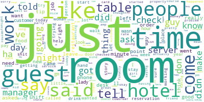
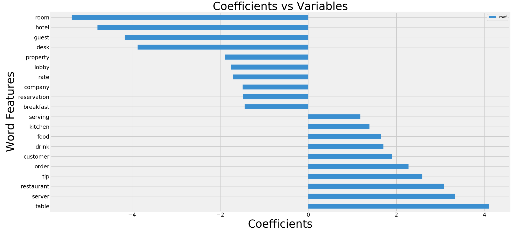

# Project 3 - Enhancing Efficiency in Service Transformation through Differentiation of Customers' Reddit Posts (Web APIs and Classification)
_Author: Jason Chia (JC)_

---

## Problem Statement and Executive Summary 
---

Using an algorithm to rapidly filter out similar but distinct subreddit posts in the service sector (eg. service-related posts from servers like waitresses, busboys, and front desk staff, where common subjects found in these could be wait time, people, and whether or not staff treatment is just or not for instance) can help save a lot of time for recruitment firms recruiting servers like waitresses and busboys and those recruiting front desk staff, as well as trade unions or organizations like [National Trades Union Congress (NTUC)](https://www.ntuc.org.sg/wps/portal/up2/home/industrialrelations/unionsandu), as they no longer need to read through each post to filter out relevant ones for them to address, to boost service standards, maximize customer experiences, and transform the service sector.

In this proposal, I present a predictive model that is able to predict with <font size=20>96%</font> accuracy whether a given post comes from a ```TalesFromYourServer```(server tales) or ```TalesFromTheFrontDesk```(frontdesk tales) subreddits based on the content of the posts. In order to develop this model, I have run Logistic Regression and Naive Bayes models on the cleaned dataset that has been scraped from the 2 subreddits and evaluated them with classification metrics such as accuracy, ROC AUC etc. in order to determine the best model of choice for this prediction task.  

This proposal presents a foundational predictive model to be built upon (as more relevant data is collected to train it) and will add value to the various organizations mentioned above by pre-filtering online server/frontdesk-specific staff opinion for them to address and/or take action(s) on, such as addressing staffs' concerns/dissatisfaction that staff would otherwise not be comfortable expressing to their management directly. This can facilitate near-real-time service transformation that will in turn boost customers' experiences in the long run!

This readme serves to inform the gist of what this solution is all about. It has been broken down into the following contents, for your reference.


### Contents:

- [Data Collection and Cleaning](#Data-Collection-and-Cleaning)
- [Feature Engineering](#Feature-Engineering)
- [Feature and Target Definitions and Preprocessing](#Feature-and-Target-Definitions-and-Preprocessing)
- [Exploratory Data Analysis of Preprocessed Texts](#Exploratory-Data-Analysis-of-Preprocessed-Texts)
- [Modelling and Hyperparameter Tuning](#Modelling-and-Hyperparameter-Tuning)
- [Interpretation of Results](#Interpretation-of-Results)
- [Model Evaluation and Limitations](#Model-Evaluation-and-Limitations)
- [Conclusion and Business Recommendations](#Conclusion-and-Business-Recommendations)
- [Sources](#Sources)

---

## Data Collection and Cleaning
---
[Click here to go back to Contents](#Contents)

Data was scraped from the 2 subreddits, [```TalesFromYourServer```](https://www.reddit.com/r/TalesFromYourServer) and [```TalesFromTheFrontDesk```](https://www.reddit.com/r/TalesFromTheFrontDesk), and duplicate posts were dropped. Empty posts and those containing nulls were assumed to be missing completely at random (MCAR) and dropped. The cleaned datasets from each subreddit were combined with ```pd.concat()``` thereafter.

## Feature Engineering
---
[Click here to go back to Contents](#Contents)

The ```'subreddit'``` target column which labels if a given post is from server tales or frontdesk tales is the label column that the supervised machine learning models (Logistic Regression and Naive Bayes in this context) will learn from in the process of developing the predictive production model. The labels for each post will be mapped to 1s and 0s according class 1 and class 0 - server tales is designated class 1 while frontdesk tales is designated class 0.


## Feature and Target Definitions and Preprocessing
---
[Click here to go back to Contents](#Contents)

Feature (X) and target (y) arrays were defined and preprocessed to remove non-letter characters and to lemmatize the texts using a custom-defined function. ```train_test_split()``` was then applied to split the dataset into training and test sets to prepare for modelling later on.

## Exploratory Data Analysis of Preprocessed Texts
---
[Click here to go back to Contents](#Contents)

Initial Exploratory Data Analysis (EDA) of preprocessed texts using word clouds (sample below) were produced to get a sense of the common words present in the respective subreddits as well as the combined one. These helped to provide a rough idea about what words could be important in predicting the nature of the post (which subreddit the post comes from). 




## Modelling and Hyperparameter Tuning
---
[Click here to go back to Contents](#Contents)

The vectorizers, ```CountVectorizer()``` and ```TfidfVectorizer()```, were tuned in a pipeline using ```GridSearchCV``` with Logistic Regression to determine which of the 2 vectorizers performed better (TfidfVectorizer was better with a best accuracy score of 0.97, training accuracy score of 0.99, and a test accuracy score of 0.96). Before that, after tokenising the preprocessed text using the vectorizers, some EDA was done to get a sense what search space should be used for the hyperparameter tuning to follow later on. Logistic Regression was evaluated as a classifier as the outcome was binary and the model is interpretable by taking the exponential of each word feature (predictor)'s coefficient to make sense of the number of times as likely for a post to be derived from class 1 (server tales) over class 0 (frontdesk tales). It is also efficient and by far, the most common classification algorithm. The general workflow for modelling is to train the simplest model on the dataset and gradually train more complex models if the simpler models are not a good fit - Logistic Regression is one of the more simple models that fit the bill for initial model-fitting, for classification problems. Tuned TfidfVectorizer and Logistic Regression were then compared to TfidfVectorizer and Multinomial Naive Bayes classifier which were also tuned with ```GridSearchCV```. Multinomial Naive Bayes Classifier was considered as the dataset is textual in nature and Naive Bayes is generally fast and part of industry practice for Natural Language Processing (NLP)-related tasks such as this. Multinomial Naive Bayes was considered specifically over Bernoulli and Gaussian Naive Bayes given that the word counts are not composed of just 1s and 0s and the word features are not normally distributed (an example of a skewed distribution of a word feature was demonstrated in the jupyter notebook). The results of the comparison are shown below.


## Interpretation of Results
---
[Click here to go back to Contents](#Contents)

|<center><font size='3'>Model<center>|<center><font size='3'>Accuracy Score<br>(on test set)<center>|<center><font size='3'>Classification<br>Categories<center>|<center><font size='3'>Classification Report<br>Metrics<center>|<center><font size='3'>ROC AUC<center>|
|---|---|---|---|---|
|<center><font size='2'>***Logistic Regression<br>with<br>TfidfVectorizer (chosen)***<center>|<center>***0.96***<center>|<center>***True Negatives: 203***<br>***False Positives: 14***<br>***False Negatives: 2***<br>***True Positives: 234***<center>|<center>***Precision for class 0: 0.99***<br>***class 1: 0.94***<br>***Recall for class 0: 0.94***<br>***class 1: 0.99***<br>***F1-Score for class 0: 0.96***<br>***class 1: 0.97***<center>|<center>***~1***<center>|
|<center><font size='2'>*Multinomial Naive Bayes<br>with<br>TfidfVectorizer*<center>|<center>0.96<center>|<center>True Negatives: 209<br>False Positives: 8<br>False Negatives: 9<br>True Positives: 227<center>|Precision for class 0: 0.96<br>class 1: 0.97<br>Recall for class 0: 0.96<br>class 1: 0.96<br>F1-Score for both classes: 0.96|<center>0.99</center>|

The above table showed that both models performed about equally well, well above the baseline accuracy score of 0.52, except for minor differences in precision and recall with either class 0 or class 1. For instance, Logistic Regression is more sensitive in identifying ```TalesFromYourServer```(class 1), and perhaps precisely because of this, it has more false positives compared to the Multinomial Naive Bayes model given that its precision score for class 1 is 0.94 which is lower than that of Multinomial Naive Bayes which is 0.97. The ROC AUC for Logistic Regression is also slightly higher than that of Multinomial Naive Bayes as shown in the tabulation above. Nevertheless, both models' ROC AUC are quite close to 1 which means that the false positive and true positive rates were highly optimized.

The very high classification accuracies of both models (and in fact a lower variance for Multinomial Naive Bayes mentioned above) might suggest that the chosen subreddits are not similar enough to be deemed challenging to distinguish.

The model with Logistic Regression with TfidfVectorizer was chosen primarily because the coefficients derived from it are a mixture of both positive and negative values which indicates that it has the potential to generate balanced predictions based on the 1000 word features it was trained on, which we will get to below. The model with Multinomial Naive Bayes in place of Logistic Regression, on the contrary, only has negative coefficients - it tends to predict that a post is unlikely to come from ```TalesFromYourServer``` given each word feature it was trained on - and hence generates imbalanced predictions that are skewed towards class 0 (```TalesFromTheFrontDesk```). 



    
The graph above shows the relative magnitudes and directions of the various coefficients of word features in the corpus, with positive coefficients indicating positive correlation to the log odds of class 1 (```TalesFromYourServer```) while negative coefficients indicating positive correlation to the log odds of class 0 (```TalesFromTheFrontDesk```). To interpret them, for instance, with each additional appearance of the word, "table", in a given post, that post is 61 (```np.exp(4.11)```) times as likely to come from the ```TalesFromYourServer``` subreddit, where 4.11 is the coefficient for the word, "table", obtained from Logistic Regression. However, with each additional appearance of another word, "room", in a given post, that post is 0.005 (```np.exp(-5.38)```) times as likely to come from the ```TalesFromYourServer```, meaning that the post is alot more likely to come from ```TalesFromTheFrontDesk``` instead, which makes sense! Similarly, -5.38 is the coefficient for the word, "room", extracted from the Logistic Regression. This shows that the LogisticRegression is working just as we expect in classifying posts from the 2 above-mentioned subreddits! Given the balanced interpretability of the Logistic Regression model, this will be the model of choice to address the problem of classifying given posts to cut down time required to pre-filter posts by each of the agencies and organizations of interest. 

    
## Model Evaluation and Limitations
---
[Click here to go back to Contents](#Contents)

Only the vectorizer hyperparameters were tuned even though Logistic Regression and Multinomial Naive Bayes estimators were fitted into the pipeline in the ```GridSearchCV``` process, as it was quite computationally intensive to tune both estimators' and vectorizers' hyperparameters simultaneously using ```GridSearchCV```. Perhaps, ```RandomizedSearchCV``` could be used instead to tune the hyperparameters of both the vectorizers and estimators, although since the accuracy scores were already very high (at 96%) and thus the extent of the increment in the accuacy scores that could be brought about by hyperparameter tuning of both the vectorizers and estimators in a ```RandomizedSearchCV``` remains debatable.
    
Simplifying assumptions were made for both Logistic Regression and Naive Bayes such as linear relationships between the word features/predictors and the log of odds of class 1 (```TalesFromYourServer```) for the former, and independence of word features/predictors for both. These means that the models used were rather simple and higher bias could result. Moreover, the assumption that words are independent of one another in texts is highly unrealistic, even though the classification accuracies were high.
    
Due to lack of full understanding on how Reddit works, some of the empty posts were assumed to be MCAR and dropped but they could have been populated instead by the title of their posts as some users do post their message in the title and leave the actual post field empty - that does not mean that the user has no comments, but instead, means that the user provided the comments under another key of the original json dictionary instead. Fortunately, only less than 10% of the data was removed all in all.
    
Given that both models used performed almost as well, a third classifier such as K-Nearest Neighbors classifier could be trained on the model and tested to determine if there is any difference in accuracy (and other classification metric) from the Logistic Regression and Naive Bayes models.
    
There were only 900+ and 800+ unique posts scraped from the ```TalesFromYourServer``` and ```TalesFromTheFrontDesk``` respectively. As with all data science problems, we can consider gathering more data, beyond 1000 posts per subreddit to examine how the accuracy scores change (whether further improve or decrease). 

    
## Conclusion and Business Recommendations
---
[Click here to go back to Contents](#Contents) 

Model using TfidfVectorizer and Logistic Regression with gridsearch's optimized features yielded a high predictive accuracy of 96%. Hence, this is a recommendeded solution for agencies like trade unions and NTUC, as well as recruitment firms in the hospitality and food and beverage industries to pre-filter online staff posts, in order to boost efficiency in addressing relevant posts, with the ultimate aim of enhancing service staff morale, maximizing service standards, customer experience, business value, and competitiveness.

A caveat however, is that the model was built on Reddit posts. The Reddit community is primarily non-Singaporean and thus [cultural differences](https://www.singaporeexpats.com/resources-in-singapore/articles/84/etiquette-differences-between-singapore-and-america.htm) may render such a model less relevant in Singapore. This proposal with its robust accuracy nevertheless presents a good conceptual model to be built upon - localized data could be collected from local variations of Reddit such as [Hardware Zone](https://forums.hardwarezone.com.sg) to gather more local staff opinion on server and front desk matters to train the model accordingly for generalizability. A point to note is that 'singlish' terms may surface in EDA of such local platforms, which may throw off the model's predictions.
    
This model could also be tested on other similar but distinct sub-sectors of the service industry too to expedite parsing of online posts with the eventual aim of boosting staff morale, which will in turn translate into enhanced customer experiences!

## Sources
---
[Click here to go back to Contents](#Contents)

- https://www.reddit.com/
- https://www.datacamp.com/community/tutorials/wordcloud-python
- https://www.reddit.com/r/TalesFromYourServer
- https://www.reddit.com/r/TalesFromTheFrontDesk
- https://www.ntuc.org.sg/wps/portal/up2/home/industrialrelations/unionsandu
- https://www.singaporeexpats.com/resources-in-singapore/articles/84/etiquette-differences-between-singapore-and-america.htm
- https://forums.hardwarezone.com.sg